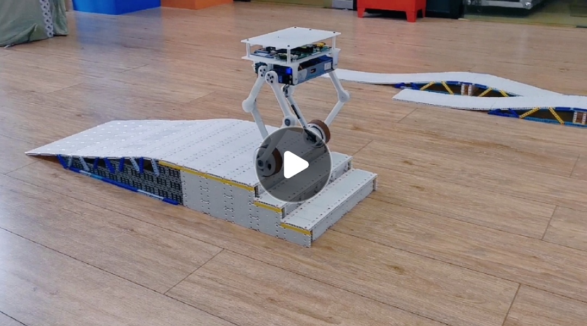
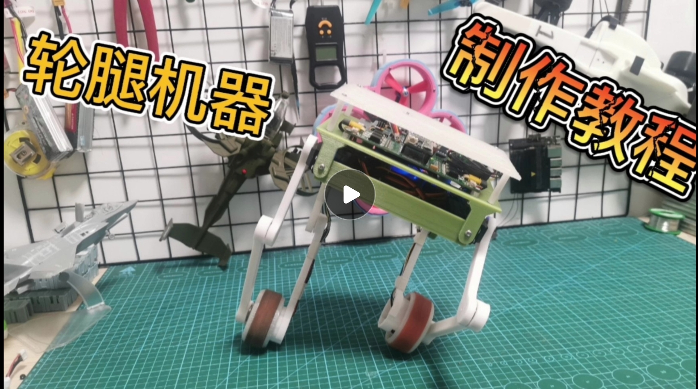
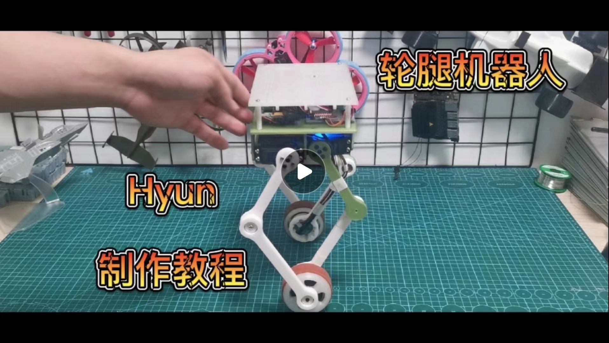

# 轮腿机器人——Hyun

## 问题：
- 硬件的工程文件已经重新上传，之前由于上传文件大于25M导致文件缺失了一些无法正常打开。
- 不建议使用电机自带的磁铁，否则编码器IC读到的噪声会很大。
- 陀螺仪要是焊接到主板上就要修改程序的横滚角和俯仰角。
- 第一次制作不建议在程序里加代码，会影响算法的刷新频率，导致Hyun出现抖动。

## 演示视频

## 装配教程

## 搭建开发环境教程

### 1. 主板PCB

### 2. FOC驱动器PCB

### 3. 磁编码器PCB

